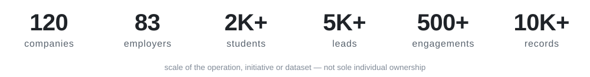
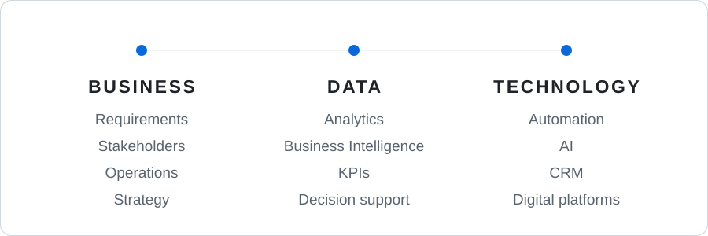
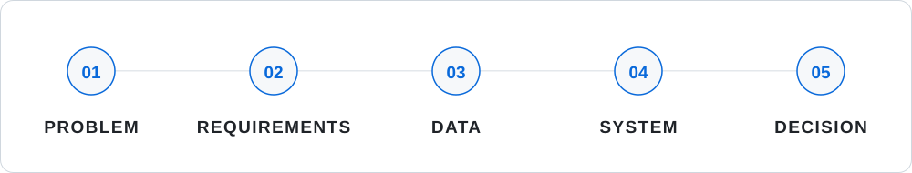

<picture>
  <source media="(prefers-color-scheme: dark)" srcset="assets/hero-dark.svg">
  <source media="(prefers-color-scheme: light)" srcset="assets/hero-light.svg">
  
</picture>

Dubai, UAE &nbsp;&nbsp;·&nbsp;&nbsp;
<a href="https://www.linkedin.com/in/bharat-gupta-29692a2a9/"><b>LinkedIn</b></a> &nbsp;&nbsp;·&nbsp;&nbsp;
<a href="mailto:bharatg0904@gmail.com"><b>Email</b></a>

<a href="#business--data--technology">ABOUT</a> &nbsp;·&nbsp;
<a href="#where-the-work-happens">EXPERIENCE</a> &nbsp;·&nbsp;
<a href="#selected-work">WORK</a> &nbsp;·&nbsp;
<a href="#business-development">BUSINESS DEVELOPMENT</a> &nbsp;·&nbsp;
<a href="#stack">STACK</a> &nbsp;·&nbsp;
<a href="#credentials">CREDENTIALS</a>

  

<picture>
  <source media="(prefers-color-scheme: dark)" srcset="assets/metrics-dark.svg">
  <source media="(prefers-color-scheme: light)" srcset="assets/metrics-light.svg">
  
</picture>

## Business × Data × Technology

I work where business operations, data and technology meet — translating operational problems into
measurable workflows, analytical systems and digital products.

<picture>
  <source media="(prefers-color-scheme: dark)" srcset="assets/triad-dark.svg">
  <source media="(prefers-color-scheme: light)" srcset="assets/triad-light.svg">
  
</picture>

## Where the work happens

**Career Services Division** &nbsp;·&nbsp; BITS Pilani Dubai Campus

A university career services division is a real commercial operation — a market to research, an
employer pipeline to build, hiring events to deliver, and leadership that needs evidence rather
than anecdote. My work spans every side of it.

<table>
<tr>
<td width="50%" valign="top">

**BUSINESS &amp; ANALYTICS**

Business analysis 
Business intelligence 
KPI reporting 
Placement analytics 
Operational reporting

</td>
<td width="50%" valign="top">

**BUSINESS DEVELOPMENT**

Employer prospecting 
Lead generation 
Market research 
Decision-maker identification 
Employer engagement

</td>
</tr>
<tr>
<td width="50%" valign="top">

**OPERATIONS**

Recruitment operations 
Placement operations 
Recruitment campaigns 
Event logistics 
Process optimisation

</td>
<td width="50%" valign="top">

**MANAGEMENT**

Stakeholder management 
Cross-functional coordination 
Career fairs 
Placement drives 
Operational planning

</td>
</tr>
<tr>
<td width="50%" valign="top">

**DIGITAL TRANSFORMATION**

CRM 
Workflow automation 
AI-enabled recruitment 
Digital platforms 
Reporting automation

</td>
<td width="50%" valign="top">

**DATA**

Data cleaning 
Transformation 
Modelling 
Trend analysis 
Decision support

</td>
</tr>
</table>

## Selected work

`01`

### EMPLOYER RELATIONSHIP CRM

Turning fragmented employer relationships into a centralised operating system.

**10,000+ employer records** 
CRM · Recruitment · Automation &nbsp;&nbsp; `Supabase` `Vercel`

<b>DETAIL &nbsp;&#8594;</b>
 

Employer profiles · Recruiter and contact management · Contact history · Meeting logs · Recruitment
pipelines · Interview tracking · Task management · Follow-up reminders · Role-based access ·
Advanced search · Operational dashboards · Reporting

**Impact** — employer data centralised, duplicate records reduced, follow-ups automated rather than
remembered, and one operational view the whole team can work from.

---

`02`

### PAPERLESS CAREER FAIR

Replacing paper-based recruitment workflows with structured digital interactions.

**Every interaction captured as data** 
QR identification · Recruiter workflow &nbsp;&nbsp; `Workflow design` `Event operations`

<b>DETAIL &nbsp;&#8594;</b>
 

Digital registration · Student, recruiter and administrator workflows · QR-based candidate
identification · Recruiter scanning · Candidate bookmarking · Interview notes · Recruiter
dashboards · Administrator dashboards · Event management · Centralised interaction data

**Impact** — paperless recruitment workflow, live visibility of the event for administrators, and
an analysable dataset with real follow-up capability at the end of the day.

---

`03`

### AI RESUME SCREENING

Turning unstructured resumes into structured candidate intelligence.

**Unstructured resumes → ranked candidates** 
LLM · NLP · Recruitment &nbsp;&nbsp; `ATS scoring` `Job matching`

<b>DETAIL &nbsp;&#8594;</b>
 

Resume parsing · ATS compatibility scoring · Skill extraction · Keyword analysis · Job matching ·
Candidate ranking · Personalised resume feedback · AI-generated interview questions ·
Recruiter-facing interface

**Impact** — recruiters start from consistent evidence rather than a stack of PDFs, and candidates
receive specific feedback instead of silence. Decision support: the hiring call stays with the
recruiter.

---

`04`

### PLACEMENT ANALYTICS

From placement data to decision support.

**Conversion visible at every stage** 
Power BI · Data modelling · KPI design &nbsp;&nbsp; `Drill-down` `Reporting`

<b>DETAIL &nbsp;&#8594;</b>
 

**Data model** — students · academics · placement status · internships · skills · resumes ·
recruiter assignments · preferred industries and roles · applications · offers

**KPIs** — placement rates · student engagement · company participation · applications · interview
conversion · offer conversion · department-level performance · batch-level statistics · academic
trends

---

### More analytics &amp; intelligent systems

<table>
<tr><td width="50%" valign="top">

`05` **Student Analytics &amp; Placement Intelligence**

Student data cleaned, modelled and segmented into dynamic dashboards supporting recruitment
planning.

`Power BI` `Segmentation`

</td><td width="50%" valign="top">

`06` **Recruitment Analytics &amp; Employer Reporting**

Recruitment KPIs and employer engagement measures turned into standardised, automated reporting.

`KPI reporting` `Excel`

</td></tr>
<tr><td width="50%" valign="top">

`07` **Automated Employer Registration**

Manual sign-up replaced by an event-driven form workflow producing analysis-ready data by default.

`Automation` `Schema design`

</td><td width="50%" valign="top">

`08` **Real-Time E-commerce Analytics**

**100,000+ records** of customer behaviour and transactions tracked for KPI and conversion analysis.
XGBoost **84.1%**, ROC-AUC **0.99**.

`Behavioural` `XGBoost`

</td></tr>
<tr><td width="50%" valign="top">

`09` **NLP &amp; Sentiment Analytics**

Unstructured customer reviews turned into a measurable signal with a fine-tuned BERT classifier at
**94.2%** accuracy.

`NLP` `BERT`

</td><td width="50%" valign="top">

`10` **Computer Vision &amp; Privacy Research**

Age-invariant face recognition combining image processing with privacy-preserving techniques.
SFace ≈ **97.6%** across **210+ test cases**.

`Computer vision` `Research`

</td></tr>
</table>

<i>These are professional and academic workstreams; source repositories are not public.</i>

## How I approach problems

<picture>
  <source media="(prefers-color-scheme: dark)" srcset="assets/process-dark.svg">
  <source media="(prefers-color-scheme: light)" srcset="assets/process-light.svg">
  
</picture>

Understand the operational problem → translate it into measurable requirements → structure and
analyse the data → build the dashboard, workflow or system → turn the result into decision support.

## Business development

Employer relationships do not appear on their own. A meaningful part of my work is the commercial
front end — finding the companies worth talking to, reaching the person who can decide, and turning
that into a relationship the division can rely on.

**RESEARCH** → **TARGET** → **QUALIFY** → **ENGAGE** → **RELATIONSHIP** → **RECRUITMENT PIPELINE**

Worked across **5,000+ prospective employer leads** and **500+ company engagements**, covering
market and prospect research, target-company and decision-maker identification, lead qualification,
personalised outreach, follow-up, partnership development and pipeline management.

`LinkedIn` `Apollo.io` `Hunter.io` `ContactOut` `AI-assisted research`

## Stack

**DATA &amp; BI** &nbsp; `Power BI` `Advanced Excel` `SQL` `Tableau` `Superset`

**PROGRAMMING** &nbsp; `Python` `SQL`

**BUSINESS** &nbsp; `Business analysis` `Requirements` `KPI design` `Process optimisation`

**OPERATIONS** &nbsp; `Recruitment operations` `Employer engagement` `Stakeholder management`

**AUTOMATION** &nbsp; `Workflow automation` `Google Sheets` `WIX`

**AI** &nbsp; `LLMs` `NLP` `AI-assisted workflows` `Claude` `ChatGPT` `Gemini` `Perplexity`

**PLATFORMS** &nbsp; `Supabase` `Vercel` `GitHub`

## Credentials

**BCG** — Data Science Job Simulation · [verify](https://forage-uploads-prod.s3.amazonaws.com/completion-certificates/SKZxezskWgmFjRvj9/Tcz8gTtprzAS4xSoK_SKZxezskWgmFjRvj9_BgHKoZ93ZF92JFhWQ_1751749665174_completion_certificate.pdf) 
**Deloitte Australia** — Data Analytics Job Simulation · [verify](https://forage-uploads-prod.s3.amazonaws.com/completion-certificates/9PBTqmSxAf6zZTseP/io9DzWKe3PTsiS6GG_9PBTqmSxAf6zZTseP_BgHKoZ93ZF92JFhWQ_1749915487560_completion_certificate.pdf) 
**Cisco Networking Academy** — Data Analytics Essentials · [verify](https://www.credly.com/badges/c5652c63-1ebe-41c3-bc56-4de42470313f/public_url) 
**Coursera** — Exploratory Data Analysis · [verify](https://coursera.org/share/d836b286758351e1dfd8dabbc1819e52) 
**AWS Training** — Data Engineering on AWS, Foundations

**B.E. Computer Science** — BITS Pilani Dubai Campus · Sep 2022 – Sep 2026

---

### Building better business systems with data?

BUSINESS ANALYSIS &nbsp;·&nbsp; ANALYTICS &nbsp;·&nbsp; OPERATIONS &nbsp;·&nbsp; AUTOMATION &nbsp;·&nbsp; AI

<a href="https://www.linkedin.com/in/bharat-gupta-29692a2a9/"><b>LinkedIn</b></a>
&nbsp;·&nbsp;
<a href="mailto:bharatg0904@gmail.com"><b>bharatg0904@gmail.com</b></a>

