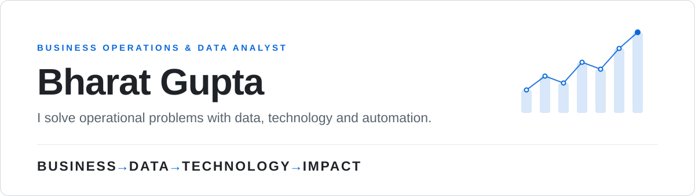

  <picture>
    <source media="(prefers-color-scheme: dark)" srcset="assets/hero-dark.svg">
    <source media="(prefers-color-scheme: light)" srcset="assets/hero-light.svg">
    
  </picture>

  

    <a href="https://www.linkedin.com/in/bharat-gupta-29692a2a9/"><b>LinkedIn</b></a>
    &nbsp;·&nbsp;
    <a href="mailto:bharatg0904@gmail.com"><b>Email</b></a>
    &nbsp;·&nbsp;
    Dubai, UAE
  

  

    <a href="#where-i-work">Where I work</a>
    &nbsp;·&nbsp;
    <a href="#what-i-do">What I do</a>
    &nbsp;·&nbsp;
    <a href="#flagship-work">Flagship work</a>
    &nbsp;·&nbsp;
    <a href="#analytics-and-technical-work">Analytics</a>
    &nbsp;·&nbsp;
    <a href="#business-development">Business development</a>
    &nbsp;·&nbsp;
    <a href="#toolkit">Toolkit</a>
  

---

I work at the point where **business operations, data and technology** meet. Most of my work starts
with an operational problem — a process that leaks time, a decision being made without evidence, a
dataset nobody can actually use — and ends with a system, a dashboard or an automated workflow that
people use in their day job.

That work happens inside recruitment and placement operations: employers to research and engage,
hiring drives to run, thousands of employer and student records to keep meaningful, and leadership
that needs to know whether any of it is working.

I am not only the analyst in that picture. I understand the operation that produces the data, the
stakeholders who depend on it, and the technology that can change how it runs.

> [!NOTE]
> **Open to** — Business Analyst · Data Analyst · Business Intelligence Analyst · Business
> Operations Analyst · Product / Operations Analyst · Analytics &amp; Technology Consulting ·
> Digital Transformation

---

## Where I work

**Business Operations &amp; Data Analyst** — Career Services Division, BITS Pilani Dubai Campus

A university career services division is a real commercial operation. There is a market to research,
a pipeline of employers to build and keep warm, hiring events to deliver, candidates to prepare and
route, and a leadership team that needs evidence rather than anecdote. My work spans every side of
it — which is why this role, rather than any single project, is the centre of my profile.

| | |
|---|---|
| **Business &amp; Analytics** | Business analysis · Data analysis · Business intelligence · KPI reporting · Dashboard development · Recruitment, employer, student and placement analytics · Operational reporting · Data cleaning, transformation and modelling · Trend analysis · Decision support · Reporting automation |
| **Business Development** | Employer prospecting · Lead generation · Market research · Target-company and decision-maker identification · Lead qualification · Employer outreach · Strategic partnerships · Relationship management · Recruitment pipeline management |
| **Operations** | Recruitment and placement operations · Recruitment campaigns · Interview coordination · Employer and student communication · Recruitment and event logistics · Operational issue resolution · Workflow optimisation · Process improvement |
| **Management &amp; Coordination** | Cross-functional coordination across employers, students, faculty and leadership · Stakeholder management · Career fair execution · Placement-drive coordination · Operational planning · Timeline and task coordination |
| **Technology &amp; Transformation** | CRM development · BI platforms · Power BI · Excel and reporting automation · Workflow automation · AI-enabled recruitment · Digital career-fair systems · Digital transformation |

**The scale this work operates within**

| `120` | `83` | `2,000+` | `5,000+` | `500+` | `10,000+` |
|:--:|:--:|:--:|:--:|:--:|:--:|
| companies registered | employers participating | students supported | prospective employer leads | company engagements | employer records |

<i>These figures describe the scale of the operation, initiative or dataset the work was carried
out within — not sole individual ownership of every outcome.</i>

---

## What I do

How the capabilities connect, rather than a list of skills:

- **Business Analysis** &nbsp;→&nbsp; Requirements &nbsp;→&nbsp; Process mapping &nbsp;→&nbsp; Functional specification
- **Data &amp; BI** &nbsp;→&nbsp; SQL &nbsp;→&nbsp; Python &nbsp;→&nbsp; Excel &nbsp;→&nbsp; Power BI &nbsp;→&nbsp; KPI reporting
- **Business Operations** &nbsp;→&nbsp; Recruitment &nbsp;→&nbsp; Placement &nbsp;→&nbsp; Workflow &nbsp;→&nbsp; Process optimisation
- **Business Development** &nbsp;→&nbsp; Market research &nbsp;→&nbsp; Lead generation &nbsp;→&nbsp; Employer engagement
- **Digital Transformation** &nbsp;→&nbsp; CRM &nbsp;→&nbsp; Automation &nbsp;→&nbsp; Digital platforms
- **AI &amp; Intelligent Systems** &nbsp;→&nbsp; LLMs &nbsp;→&nbsp; NLP &nbsp;→&nbsp; Resume intelligence &nbsp;→&nbsp; AI automation

---

## Flagship work

### Employer Relationship Management (CRM)

`Business Transformation` `CRM` `Recruitment Workflows` `Supabase` `Vercel`

**Problem.** Employer management ran on spreadsheets and individual memory. Contact history
fragmented across inboxes, records duplicated, follow-ups slipped, and nobody could answer *who has
spoken to this company, and what happened next*.

**Approach.** Translate the division's working practices into requirements, then into a centralised
employer relationship platform — a database-driven system built around a base of **10,000+ employer
records**, with AI-assisted development used to move faster on the build.

**Impact.** Employer information centralised in one place, duplicate records reduced, follow-ups
automated rather than remembered, and a single operational view of the employer relationship that
the whole team can access.

<b>Capabilities</b>

 

Employer profiles · Recruiter and contact management · Contact history · Meeting logs · Recruitment
pipelines · Interview tracking · Task management · Follow-up reminders · Role-based access ·
Advanced search · Operational dashboards · Reporting · Centralised employer data

 

### Paperless Career Fair Platform

`Digital Transformation` `Workflow Design` `Event Operations` `Structured Data Capture`

**Problem.** A career fair traditionally runs on printed resumes, manual sign-in sheets and
recruiters trying to remember who impressed them. The administrative cost is high and, worse, the
event produces no usable record of itself.

**Approach.** Map the existing manual workflow, write the functional specification, and rebuild the
event as a digital process covering all three audiences — students, recruiters and administrators —
with QR-based candidate identification at its centre.

**Impact.** A paperless recruitment workflow where every recruiter–student interaction is captured
as structured data, recruiters work from dashboards instead of paper, administrators get live
visibility of the event, and the division ends the day with an analysable dataset and a real
follow-up capability.

<b>Capabilities</b>

 

Digital registration · Student workflows · Recruiter workflows · Administrator workflows ·
QR-based candidate identification · Recruiter scanning · Candidate bookmarking · Interview notes ·
Recruiter dashboards · Administrator dashboards · Event management · Centralised interaction data

 

### AI Resume Screening &amp; Talent Intelligence

`Applied AI` `LLM / NLP` `Recruitment Automation` `Decision Support`

**Problem.** Screening high volumes of applications by hand is slow and inconsistent — the same
candidate is assessed differently depending on who reads the resume and how late in the day it is.

**Approach.** Use LLM and NLP techniques to turn unstructured resumes into structured candidate
intelligence: parse the document, extract skills, score against the role, and rank candidates on
comparable criteria through a recruiter-facing interface.

**Impact.** Recruiters start from structured, consistent evidence instead of a stack of PDFs.
Candidates receive specific feedback rather than silence. The intent is decision support — the
hiring decision stays with the recruiter.

<b>Capabilities</b>

 

Resume parsing · ATS compatibility scoring · Skill extraction · Keyword analysis · Job matching ·
Candidate ranking · Personalised resume feedback · AI-generated interview questions · Structured
extraction from unstructured resumes · Recruiter-facing interface · AI-assisted hiring insights

 

### Placement Analytics &amp; Business Intelligence Platform

`Business Intelligence` `Power BI` `KPI Design` `Decision Support`

**Problem.** A placement team can always describe last year. The harder question is *what should we
do next season* — which departments are underperforming, where candidates drop out of the funnel,
how many employers need to be brought in.

**Approach.** Consolidate the placement data model — students, academics, placement status,
internships, skills, resumes, recruiter assignments, preferred industries and roles, applications
and offers — then design the KPI layer and build it as interactive BI with drill-down and dynamic
filtering rather than static monthly reports.

**Impact.** Conversion visible at every stage of the funnel, department and batch performance
comparable side by side, and planning decisions made against evidence.

<b>KPIs and measures</b>

 

Placement rates · Student engagement · Company participation · Applications · Interview conversion ·
Offer conversion · Department-level performance · Batch-level statistics · Academic trends

---

## Analytics and technical work

<b>Student Analytics &amp; Placement Intelligence</b> — segmentation and planning support

 

`Power BI` `Data Modelling` `Segmentation`

Cleaning, transformation and modelling of student data into an analytical layer covering placement
preferences and student segmentation. Built as dynamic dashboards for operational reporting, used to
support recruitment planning and give stakeholders a defensible basis for decisions rather than
assumptions about what a cohort wants.

<b>Recruitment Analytics &amp; Employer Reporting</b> — operational performance visibility

 

`KPI Reporting` `Power BI` `Excel` `Automated Reporting`

Recruitment KPIs, employer engagement measures and placement metrics brought into standardised,
repeatable reporting. Data integration across sources, automated report generation, and dynamic
visualisations replacing manual reporting cycles — so operational performance is visible
continuously rather than reconstructed at quarter end.

<b>Automated Employer Registration</b> — workflow automation

 

`Workflow Automation` `Schema Design` `Google Sheets` `Event-Driven Process`

Manual employer registration replaced with a structured digital form and an event-driven workflow:
submission triggers automated confirmation and writes a clean record to a central sheet. The field
schema was designed so the output is analysis-ready by default, removing both the manual
coordination step and the data-cleaning step that used to follow it.

<b>Real-Time E-commerce Analytics</b> — customer behaviour and KPI tracking

 

`Behavioural Analytics` `KPI Tracking` `Dashboards` `XGBoost`

A real-time analytics system built over **100,000+ e-commerce records**, analysing customer
behaviour and transaction trends to identify what actually drives performance, surfaced through
dashboards built for decision-making rather than description. Predictive modelling on the
behavioural data reached **84.1%** accuracy with **XGBoost** at a **0.99 ROC-AUC**, supporting
segmentation of customers by likelihood to convert.

<b>NLP &amp; Sentiment Analytics</b> — unstructured feedback as a measurable signal

 

`NLP` `BERT` `Classification` `Model Evaluation`

Customer reviews are the largest source of honest feedback most businesses hold and the least used,
because nobody can read them at volume. A fine-tuned **BERT** classifier reaching **94.2%** accuracy
turned that unstructured text into a measurable signal — what customers raise, in what volume, and
whether it is improving or deteriorating.

<b>Computer Vision &amp; Privacy Research</b> — age-invariant recognition

 

`Computer Vision` `Privacy-Preserving Techniques` `Research Methodology`

Research into age-invariant face recognition, where conventional matching degrades sharply as the
gap between reference and probe images widens. Work combined image processing with
privacy-preserving techniques and structured experimentation, with the **SFace** model reaching
approximately **97.6%** accuracy across **210+ test cases**.

---

## Business development

Employer relationships do not appear on their own. A meaningful part of my work is the commercial
front end of the operation — finding the companies worth talking to, reaching the person who can
actually make a decision, and turning that into a recruiting relationship the division can rely on.

- **Research and targeting** — market research, prospect research, target-company identification and decision-maker identification across a base of **5,000+ prospective employer leads**
- **Qualification and outreach** — lead qualification, personalised outreach, structured email and phone follow-up
- **Relationship and pipeline** — employer engagement, partnership development, employer database management and recruitment pipeline management

`LinkedIn` `Apollo.io` `Hunter.io` `ContactOut` `AI-assisted research`

This connects directly to everything above: the leads become employer records in the CRM, the
engagements become pipeline, and the pipeline becomes the recruitment analytics the division plans
against.

---

## Toolkit

| | |
|---|---|
| **Analytics &amp; BI** | Power BI · Advanced Excel · SQL · Tableau · Superset |
| **Data** | Python · Data cleaning · Data transformation · Data modelling · Statistical and descriptive analysis |
| **Business &amp; Operations** | Business analysis · KPI tracking · Requirements gathering · Process optimisation · Stakeholder management · Recruitment operations · Employer engagement |
| **Automation** | Workflow automation · Google Sheets · WIX · Event-driven processes |
| **AI** | LLMs · NLP · AI-assisted workflows · Claude · ChatGPT · Gemini · Perplexity |
| **Platforms** | Supabase · Vercel · GitHub |

---

## Credentials

| Certification | Issuer | |
|---|---|---|
| Data Science Job Simulation | BCG · Forage | [Verify](https://forage-uploads-prod.s3.amazonaws.com/completion-certificates/SKZxezskWgmFjRvj9/Tcz8gTtprzAS4xSoK_SKZxezskWgmFjRvj9_BgHKoZ93ZF92JFhWQ_1751749665174_completion_certificate.pdf) |
| Data Analytics Job Simulation | Deloitte Australia · Forage | [Verify](https://forage-uploads-prod.s3.amazonaws.com/completion-certificates/9PBTqmSxAf6zZTseP/io9DzWKe3PTsiS6GG_9PBTqmSxAf6zZTseP_BgHKoZ93ZF92JFhWQ_1749915487560_completion_certificate.pdf) |
| Data Analytics Essentials | Cisco Networking Academy | [Verify](https://www.credly.com/badges/c5652c63-1ebe-41c3-bc56-4de42470313f/public_url) |
| Exploratory Data Analysis | Coursera | [Verify](https://coursera.org/share/d836b286758351e1dfd8dabbc1819e52) |
| Data Engineering on AWS — Foundations | AWS Training | — |

**B.E. Computer Science** — BITS Pilani Dubai Campus · Sep 2022 – Sep 2026

---

### Let's talk

If you are solving a business problem with data, operations and automation — and you want someone
who understands all three — I would like to hear about it.

<a href="https://www.linkedin.com/in/bharat-gupta-29692a2a9/"><b>Connect on LinkedIn</b></a>
&nbsp;·&nbsp;
<a href="mailto:bharatg0904@gmail.com"><b>bharatg0904@gmail.com</b></a>

