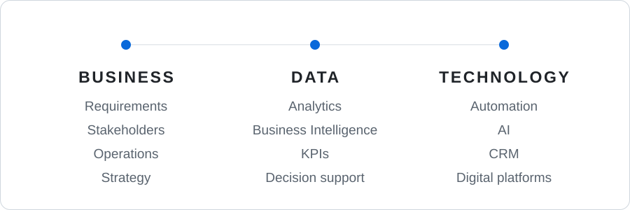
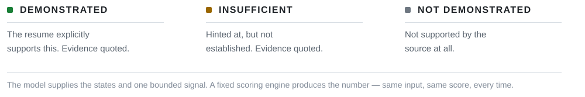

<picture>
  <source media="(max-width: 520px) and (prefers-color-scheme: dark)" srcset="assets/hero-m-dark.svg">
  <source media="(max-width: 520px)" srcset="assets/hero-m-light.svg">
  <source media="(prefers-color-scheme: dark)" srcset="assets/hero-dark.svg">
  <source media="(prefers-color-scheme: light)" srcset="assets/hero-light.svg">
  
</picture>

Dubai, UAE &nbsp;·&nbsp; [LinkedIn](https://www.linkedin.com/in/bharat-gupta-29692a2a9/) &nbsp;·&nbsp; [Email](mailto:bharatg0904@gmail.com)

 

<picture>
  <source media="(max-width: 520px) and (prefers-color-scheme: dark)" srcset="assets/metrics-m-dark.svg">
  <source media="(max-width: 520px)" srcset="assets/metrics-m-light.svg">
  <source media="(prefers-color-scheme: dark)" srcset="assets/metrics-dark.svg">
  <source media="(prefers-color-scheme: light)" srcset="assets/metrics-light.svg">
  
</picture>

 

## Business × Data × Technology

I work where business operations, data and technology meet — translating operational problems into
measurable workflows, analytical systems and digital products.

<picture>
  <source media="(max-width: 520px) and (prefers-color-scheme: dark)" srcset="assets/triad-m-dark.svg">
  <source media="(max-width: 520px)" srcset="assets/triad-m-light.svg">
  <source media="(prefers-color-scheme: dark)" srcset="assets/triad-dark.svg">
  <source media="(prefers-color-scheme: light)" srcset="assets/triad-light.svg">
  
</picture>

 

## Where the problems come from

**Career Services Division** &nbsp;·&nbsp; BITS Pilani Dubai Campus

A university career services division is a real commercial operation — a market to research, an
employer pipeline to build, hiring events to deliver, and leadership that needs evidence rather
than anecdote. My work spans every side of it, which is where every system below started: not as
a project idea, but as something that was going wrong in front of me.

 

**BUSINESS &amp; ANALYTICS** 
Business analysis · Business intelligence · KPI reporting · Placement analytics · Operational reporting · Data cleaning, transformation and modelling · Trend analysis · Decision support

**BUSINESS DEVELOPMENT** 
Employer prospecting · Lead generation · Market research · Decision-maker identification · Lead qualification · Employer outreach · Strategic partnerships · Pipeline management

**OPERATIONS** 
Recruitment operations · Placement operations · Recruitment campaigns · Interview coordination · Event logistics · Operational issue resolution · Process optimisation

**MANAGEMENT** 
Stakeholder management · Cross-functional coordination · Career fairs · Placement drives · Operational planning · Timeline and task coordination

**DIGITAL TRANSFORMATION** 
CRM development · Workflow automation · AI-enabled recruitment · Digital platforms · Reporting automation · BI platforms

 

---

 

## Selected work

Four systems, each built for a problem I had to live with. The first three are public — the
code is the documentation.

 

**01** &nbsp;/&nbsp; APPLIED AI

### TalentIQ — AI Recruitment &amp; Candidate Intelligence Platform

Most resume screeners infer. *"Worked with cloud technologies"* quietly becomes an AWS
qualification, and a recruiter acts on something the candidate never claimed.

TalentIQ refuses to infer. Every job requirement resolves to one of three states, and the two
positive states must quote the line of the resume that supports them.

<picture>
  <source media="(max-width: 520px) and (prefers-color-scheme: dark)" srcset="assets/evidence-m-dark.svg">
  <source media="(max-width: 520px)" srcset="assets/evidence-m-light.svg">
  <source media="(prefers-color-scheme: dark)" srcset="assets/evidence-dark.svg">
  <source media="(prefers-color-scheme: light)" srcset="assets/evidence-light.svg">
  
</picture>

**The language model never produces the score.** It supplies evidence states and one bounded
signal; a deterministic engine applies the weights. Ask a model twice and you get 84, then 79 — a
recruiter cannot defend a decision on that, and a rejected candidate is entitled to ask why.

Next.js 15 · TypeScript · Neon PostgreSQL · Cloudflare R2 · Groq · Row-level security

[**→ Repository**](https://github.com/BharatGupta09/TalentIQ-AI-Recruitment-Candidate-Intelligence-Platform)

<b>→ &nbsp;Explore</b>

 

AI requirement extraction from a job posting · structured specification (required / preferred /
nice-to-have) · resume parsing and ATS analysis · evidence-cited assessment against each
requirement · deterministic scoring with a full component breakdown · candidate ranking ·
recruiter workspace pairing the requirement matrix with the original PDF · multi-candidate
comparison · interview kits · pipeline board · CSV export with formula-injection guards

**Authorization lives in the database.** Roughly a hundred row-level security policies, forced on
every table, decide what each request can see — not application code that can be forgotten. Each
query runs inside its own transaction carrying the caller's identity, so an unauthenticated
request fails closed by default rather than by remembering to filter.

**Decision support, not decisions.** The recruiter's stage never overwrites the assessment, and
the two are stored separately.

---

**02** &nbsp;/&nbsp; BUSINESS TRANSFORMATION

### CorpSync — Employer Relationship Management &amp; Recruitment CRM

Two coordinators independently add the same employer. The relationship history splits in half. Six
months later nobody can tell which record is current, and the employer gets two people from the
same university asking the same questions.

CorpSync makes one record per employer the only possibility, and makes a relationship going quiet
something the system notices before a person does.

**10,000+ employer records** — the scale of the operation this was built for

React 19 · TypeScript · Express 5 on Cloudflare Workers · PostgreSQL / Neon · Server-enforced RBAC

[**→ Repository**](https://github.com/BharatGupta09/CorpSync-Employer-Relationship-Management-Recruitment-CRM) &nbsp;public demo · synthetic data only

<b>→ &nbsp;Explore</b>

 

Employer portfolios · corporate contact directory with primary-liaison and decision-maker flags ·
interaction timeline with a dated next action · recruitment pipelines across eight stages ·
today's follow-up as Today / Overdue / Upcoming · executive dashboard where every number drills
into the records behind it · relationship reports · CSV import and export · full audit trail

**Duplicate prevention at three levels** — the API checks the name and normalised website, CSV
imports flag duplicates inside the file *and* against the database, and unique indexes in the
database mean two people saving at the same moment still cannot create a duplicate.

**Health is computed, never stored.** An account score and tier — Excellent through Dormant —
derived on read from days since last contact, interaction volume and open opportunities, so it
cannot go stale.

**Access control is server-side on every route.** An account manager sees only their own
portfolio; other portfolios return 404 rather than 403, so they do not even learn those companies
exist. An executive's owner filter is forced to themselves whatever the request says.

---

**03** &nbsp;/&nbsp; DIGITAL TRANSFORMATION

### CareerFlow — Digital Career Fair &amp; Recruitment Platform

A career fair produces a pile of paper and very little data. Students print thirty résumés;
recruiters carry a stack home and cannot remember which conversation went with which sheet; and
Career Services reconstructs the day afterwards from spreadsheets and guesswork.

The usual fix is QR badges — which adds printed badges, venue lighting problems and a scanning app
on every recruiter's phone. **CareerFlow uses no QR codes and no scanners.** A candidate carries
six characters they can read aloud across a booth counter.

**Every recruiter–candidate interaction captured as data**

Next.js 15 · React 19 · TypeScript · Drizzle ORM · PostgreSQL · Server-side authorization

[**→ Repository**](https://github.com/BharatGupta09/CareerFlow-Digital-Career-Fair-Recruitment-Platform)

<b>→ &nbsp;Explore</b>

 

Structured candidate profiles and résumé versioning · multi-event fairs with their own
registration windows and booths · live check-in desk a volunteer can run · recruiter candidate
lookup as the hero interaction · favourites, pipeline stages and private notes · server-side
filtered pipeline with CSV export · analytics computed from real interaction data, scoped per
fair · seven reports, none of which expose recruiter notes · audit trail

**The code is an identifier, not a credential.** Six characters from a 30-symbol alphabet with
`O/0`, `I/1/L` and `U` removed — the ones confused on screen, in handwriting, or misheard across a
noisy hall. Possessing a code grants nothing: resolving one requires an authenticated recruiter
whose employer holds a booth at the fair that candidate registered for, and unknown codes return a
response identical to valid-but-unauthorised ones, so the API cannot be used to enumerate who
exists.

**One row per candidate × recruiter × event**, uniquely constrained — which is what makes every
analytic figure computable and stops a re-opened profile double-counting.

---

**04** &nbsp;/&nbsp; BUSINESS INTELLIGENCE

### Placement360 — Student &amp; Recruitment Analytics Platform

Moving the placement team from describing last year to deciding the next one — which domains to
target, how many employers to bring in, and where the funnel is leaking.

**Conversion visible at every stage of the funnel**

Power BI · Advanced Excel · Data modelling · KPI design · Drill-down · Automated reporting

<b>→ &nbsp;Explore</b>

 

**Data model** — students · academics · placement status · internships · skills · résumés ·
recruiter assignments · preferred industries and roles · applications · offers

**KPIs** — placement rates · student engagement · company participation · applications · interview
conversion · offer conversion · department-level performance · batch-level statistics · academic
trends

Segmentation and drill-down from a department down to an individual cohort, with the operational
reporting automated rather than rebuilt each cycle.

An internal analytics workstream rather than a public codebase — the data is real student data.

 

---

 

**05** &nbsp;/&nbsp; DATA SCIENCE

### InsightX — AI-Driven Business &amp; Customer Analytics

Traffic was up 0.7%. Conversion was down **31.8% month over month**. Nothing in the dashboard
explained the gap, because the dashboard measured volume and the problem was behaviour.

InsightX joins **200,000+ behavioural events** with **400,000 review records** to find out what
changed and, more usefully, what to do about each case.

| | |
|---|---|
| **Sentiment classification** | Fine-tuned BERT · **94.2%** accuracy |
| **Conversion modelling** | XGBoost · **84.1%** accuracy · **0.99** ROC-AUC |
| **Decision framework** | **95%** of cases auto-actioned at **95.9%** accuracy |
| **Explainability** | SHAP attribution on every prediction |

The point is not the accuracy figure. It is that a model nobody can interrogate does not get
acted on — so each prediction carries its attribution, and the 5% the framework will not commit to
is routed to a human instead of guessed at.

 

## More work

**06** &nbsp;&nbsp; **Student Analytics &amp; Placement Intelligence** 
Student data cleaned, modelled and segmented into dynamic dashboards supporting recruitment planning. &nbsp;·&nbsp; Power BI

**07** &nbsp;&nbsp; **Recruitment Analytics &amp; Employer Reporting** 
Recruitment KPIs and employer engagement measures turned into standardised, automated reporting. &nbsp;·&nbsp; Power BI · Excel

**08** &nbsp;&nbsp; **Automated Employer Registration** 
Manual sign-up replaced by an event-driven form workflow producing analysis-ready data by default. &nbsp;·&nbsp; Workflow automation · Google Sheets

**09** &nbsp;&nbsp; **Attendance &amp; Working-Time Tracking** 
Shift and working-time tracking for student coordinators, built on the same Workers + Postgres stack. &nbsp;·&nbsp; [Repository](https://github.com/BharatGupta09/career-services-attendance-demo)

 

---

 

## How I approach problems

<picture>
  <source media="(max-width: 520px) and (prefers-color-scheme: dark)" srcset="assets/method-m-dark.svg">
  <source media="(max-width: 520px)" srcset="assets/method-m-light.svg">
  <source media="(prefers-color-scheme: dark)" srcset="assets/method-dark.svg">
  <source media="(prefers-color-scheme: light)" srcset="assets/method-light.svg">
  
</picture>

The last step is the one that matters. A dashboard nobody acts on and a model nobody trusts
are the same failure — work that stopped one step short.

 

## Business development

**RESEARCH** &nbsp;→&nbsp; **TARGET** &nbsp;→&nbsp; **QUALIFY** &nbsp;→&nbsp; **ENGAGE** &nbsp;→&nbsp; **RELATIONSHIP** &nbsp;→&nbsp; **RECRUITMENT**

Employer relationships do not appear on their own. Worked across **5,000+ prospective employer
leads** and **500+ company engagements** — market and prospect research, target-company and
decision-maker identification, lead qualification, personalised outreach, follow-up, partnership
development and pipeline management.

CorpSync exists because I ran this pipeline in spreadsheets first.

LinkedIn · Apollo.io · Hunter.io · ContactOut · AI-assisted research

 

## Experience

**Business Development &amp; Data Analytics Intern** &nbsp;·&nbsp; BITS Pilani Dubai Campus — Career Services &nbsp;·&nbsp; Dec 2025 – Present 
Employer engagement and lead generation, recruitment and placement operations, KPI reporting and
dashboards, and the digital transformation of the division's manual workflows.

**GTM Sales Engineer** &nbsp;·&nbsp; Tenderd &nbsp;·&nbsp; Aug 2026 – Sep 2026 
Sales engagement and CRM platform work — accounts and prospects, lead qualification, outreach
sequences, tasks, meetings, activity tracking and reporting, with the workflow design behind them.
Email, calls, LinkedIn, WhatsApp and CSV workflows; search and filtering; role-based access,
authentication, authorization and audit logging. TypeScript · Node.js · Express · PostgreSQL /
Neon · React · Cloudflare Workers.

**Student Coordinator — Career Services** &nbsp;·&nbsp; BITS Pilani Dubai Campus &nbsp;·&nbsp; Sep 2022 – Dec 2025 
Career fairs and placement drives, employer outreach and relationship management, interview
coordination, operational issue resolution, stakeholder management and process improvement.

 

## Toolkit

**Business &amp; Analytics** &nbsp;&nbsp; Power BI · Advanced Excel · SQL · Superset · Tableau · Data modelling · KPI design · Requirements · Process optimisation

**Programming** &nbsp;&nbsp; Python · TypeScript · SQL

**Product &amp; Technology** &nbsp;&nbsp; React · Next.js · PostgreSQL · Neon · Cloudflare Workers · Vercel · GitHub

**AI** &nbsp;&nbsp; LLMs · NLP · Generative AI · Machine learning · Explainable AI · Claude · ChatGPT · Gemini

**Business Development** &nbsp;&nbsp; Apollo.io · Hunter.io · ContactOut · LinkedIn

 

## Research

**Cross-Age Face Verification Using DeepFace** &nbsp;·&nbsp; presented at an academic conference 
ArcFace, SFace and FaceNet512 compared on age-invariant verification across 210+ test cases,
measured on accuracy, precision, recall and F1. SFace reached ≈ 97.6%.

**Privacy Challenges in Image Processing Applications** 
Differential privacy, homomorphic encryption and secure multi-party computation assessed against
healthcare and surveillance computer vision — where the privacy guarantee stops being worth its
computational cost, and what that does to scalability and model utility.

 

## Credentials

**BCG** — Data Science Job Simulation, Forage &nbsp;·&nbsp; [verify](https://forage-uploads-prod.s3.amazonaws.com/completion-certificates/SKZxezskWgmFjRvj9/Tcz8gTtprzAS4xSoK_SKZxezskWgmFjRvj9_BgHKoZ93ZF92JFhWQ_1751749665174_completion_certificate.pdf)

**Deloitte Australia** — Data Analytics Job Simulation, Forage &nbsp;·&nbsp; [verify](https://forage-uploads-prod.s3.amazonaws.com/completion-certificates/9PBTqmSxAf6zZTseP/io9DzWKe3PTsiS6GG_9PBTqmSxAf6zZTseP_BgHKoZ93ZF92JFhWQ_1749915487560_completion_certificate.pdf)

**Cisco Networking Academy** — Data Analytics Essentials &nbsp;·&nbsp; [verify](https://www.credly.com/badges/c5652c63-1ebe-41c3-bc56-4de42470313f/public_url)

**Coursera** — Exploratory Data Analysis &nbsp;·&nbsp; [verify](https://coursera.org/share/d836b286758351e1dfd8dabbc1819e52)

**AWS Training** — Data Engineering on AWS, Foundations

 

## Education

**B.E. Computer Science** — BITS Pilani Dubai Campus · Sep 2022 – Sep 2026

 

---

 

### Building better business systems with data?

Open to Business Analyst, Data Analyst, Business Intelligence, Business Operations, analytics
consulting, strategy and digital transformation roles.

[LinkedIn](https://www.linkedin.com/in/bharat-gupta-29692a2a9/) &nbsp;·&nbsp; [bharatg0904@gmail.com](mailto:bharatg0904@gmail.com) &nbsp;·&nbsp; Dubai, UAE
